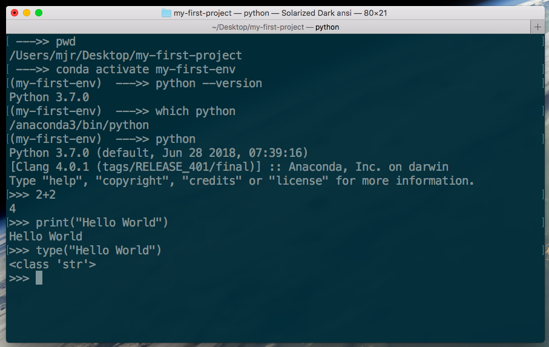
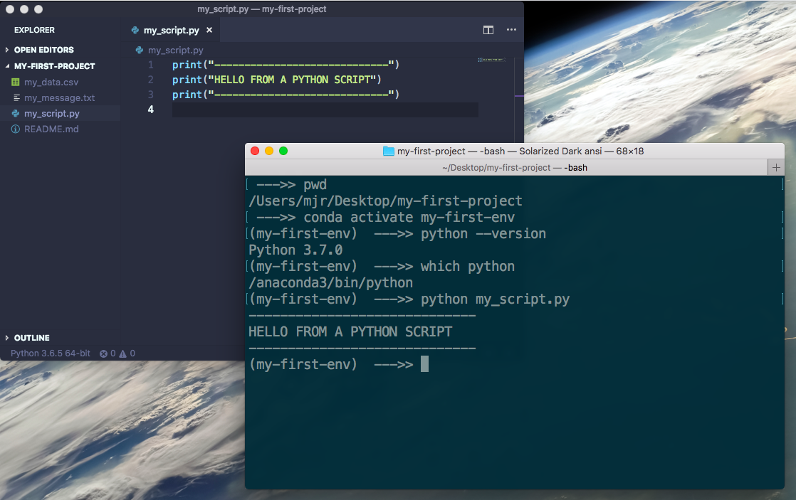

# The `python` Utility

> "Python is a programming language that lets you work quickly and integrate systems more effectively" - [Python Website](https://www.python.org/)

Before you can execute Python programs on your computer, you'll first need to install the Python command-line utility.

Over the past few years there has been a shift in the community from Python Version 2 to Python Version 3. But these days we assume everyone is using Python 3, and this semester we will be using Python 3, exclusively. We might use different minor versions of Python 3 (like 3.7 or 3.8), depending on their compatibility with specific third-party packages we may be using on a given project.

Anaconda provides a command-line utility called `conda` to help us manage different versions of Python. Before proceeding, please take a moment to [install Anaconda and get familiar with the `conda` utility](conda.md).

When you are ready, either use the Anaconda default "base" environment, or create and activate a new Anaconda environment, and within the environment execute the commands below.

## Detecting Installations

To see if Python is already installed, and if so where:

```sh
# Mac Terminal:
which python

# Windows Command Prompt or Git Bash:
where python
```

If you see a filepath output, it means Python is installed at the location specified, so you can advance to the version detection instructions below. Otherwise, if you see an empty result or an error message, that usually means Python is not installed.

## Detecting Versions

Let's see which version of Python is installed:

```sh
python --version
```

If you see a result here like "Python 3.8.3" (or some other 3.x version), it means the specified version of Python is installed, so you can advance to the usage instructions below. Otherwise, if you see an empty result, error message, or 2.x version, that usually means Python is not installed (properly).

## Usage

After Python is installed, you should be able to execute Python commands.

### Interactive Console

```sh
# Mac Terminal:
python

# Windows Git Bash:
python -i # for interactive
```

If you type `python` on Mac Terminal (or `python -i` on Windows Git Bash) and press "enter", you will enter into an interactive Python console where you can evaluate Python statements and expressions. When you are done using the Python console, you can shut it down by typing `exit()` and pressing "enter".



### Executing Scripts

You can alternatively use the `python` utility to execute a pre-written Python program, by specifying its filepath. To test this out yourself, follow the instructions in the [Hello World (Local) Exercise](./../../exercises/hello-world/local.md).

```sh
python path/to/my_script.py
```




